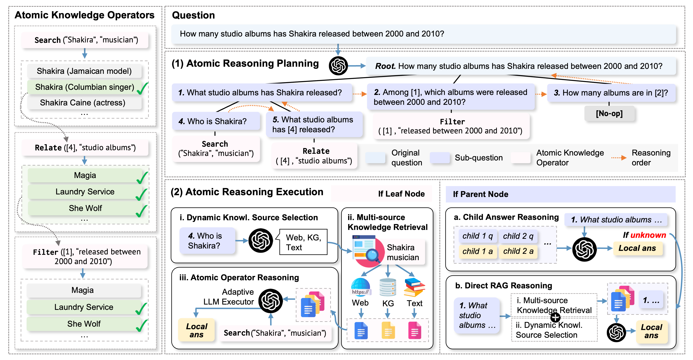

# AtomR: Atomic Operator-Empowered Large Language Models for Heterogeneous Knowledge Reasoning

<p align="center">
    <a href="https://arxiv.org/abs/2411.16495"></a>
    <a href="https://huggingface.co/datasets/THU-KEG/BlendQA"></a>
    <a href="https://github.com/THU-KEG"></a>
    <a href="https://doi.org/10.5281/zenodo.15528472"></a>
</p>

<p align="justify">

This repository contains the code and data of the [KDD 2025] Paper ***AtomR: Atomic Operator-Empowered Large Language Models for Heterogeneous Knowledge Reasoning***.

We introduce <b>AtomR</b>, a framework for LLMs to conduct accurate heterogeneous knowledge reasoning at the <i>atomic</i> level. Inspired by how knowledge graph query languages model compositional reasoning through combining predefined operations, we propose three <i>atomic knowledge operators</i>, a unified set of operators for LLMs to retrieve and manipulate knowledge from heterogeneous sources. First, in the reasoning planning stage, AtomR decomposes a complex question into a reasoning tree where each leaf node corresponds to an atomic knowledge operator, achieving question decomposition that is highly fine-grained and orthogonal. Subsequently, in the reasoning execution stage, AtomR executes each atomic knowledge operator, which flexibly selects, retrieves, and operates atomic level knowledge from heterogeneous sources. We also introduce <b>BlendQA</b>, a challenging benchmark specially tailored for heterogeneous knowledge reasoning. Experiments on three single-source and two multi-source datasets show that AtomR outperforms state-of-the-art baselines by a large margin, with F1 score improvements of 9.4% on 2WikiMultihop and 9.5% on BlendQA.

- 📖 Paper: [Atomic Operator-Empowered Large Language Models for Heterogeneous Knowledge Reasoning](https://arxiv.org/abs/2411.16495)
- 📊 BlendQA dataset on 🤗HuggingFace: [BlendQA](https://huggingface.co/datasets/THU-KEG/BlendQA)

</p>

<div  align="center"> 

</div>


## Setup Text Retriever via ColBERT 
1. To evaluate AtomR on HotpotQA, download the Wikipedia abstract dump provided by [HotpotQA](https://hotpotqa.github.io/): 

```commandline
wget https://nlp.stanford.edu/projects/hotpotqa/enwiki-20171001-pages-meta-current-withlinks-abstracts.tar.bz2 {YOUR_DIRECTORY}
```

2. To evaluate AtomR on 2WikiMultiHop, Musique, BlendQA, and CRAG, download the full December 2021 Wikipedia dump provided by [Atlas](https://github.com/facebookresearch/atlas). Follow [Atlas's Corpora download instructions](https://github.com/facebookresearch/atlas#corpora) to download the corpus ```enwiki-dec2021```.

3. Format the downloaded corpora into ColBERT format:

```commandline
cd ColBERT
python format_tsv_hotpotqa.py
python format_tsv_atlas.py
```

4. Download the ColBERTv2 model: 

```commandline
mkdir model_checkpoints
cd model_checkpoints
wget https://downloads.cs.stanford.edu/nlp/data/colbert/colbertv2/colbertv2.0.tar.gz
```

5. Index your data

```commandline
cd ..
python index_hotpotqa.py
python index_atlas.py
```

6. Setup text retrieval service via Flask

```commandline
python setup_service_hotpotqa.py
python setup_service_atlas.py
```


## Setup OpenAI service

```commandline
cd ../openai_service
python openai_service.py
```


## Run Experiments

```commandline
cd ../src
```

Run ```main.py``` and adjust the code accordingly:

#### Single-source Datasets

1. HotpotQA

```python
dataset_name = "HotpotQA"
dataset_path = "../datasets/single-source/HotpotQA/hotpotqa_test_500.jsonl"
output_trees_path = "../results/hotpotqa_test_500_trees.jsonl"
output_predictions_path = "../results/hotpotqa_test_500_predictions.jsonl"
text_retriever_url = "http://localhost:1212/api/search"  # HotpotQA wiki dump
evaluate_dataset_single_source(dataset_name=dataset_name, dataset_path=dataset_path, output_trees_path=output_trees_path, output_predictions_path=output_predictions_path, text_retriever_url=text_retriever_url)
```

2. 2WikiMultiHop

```python
dataset_name = "2WikiMultiHop"
dataset_path = "../datasets/single-source/2WikiMultiHop/2wiki_test_500.jsonl"
output_trees_path = "../results/2wiki_test_500_trees.jsonl"
output_predictions_path = "../results/2wiki_test_500_predictions.jsonl"
text_retriever_url = "http://localhost:1214/api/search"  # Atlas wiki dump
evaluate_dataset_single_source(dataset_name=dataset_name, dataset_path=dataset_path, output_trees_path=output_trees_path, output_predictions_path=output_predictions_path, text_retriever_url=text_retriever_url)
```

3. Musique

```python
dataset_name = "Musique"
dataset_path = "../datasets/single-source/Musique/musique_test_500.jsonl"
output_trees_path = "../results/musique_test_500_trees.jsonl"
output_predictions_path = "../results/musique_test_500_predictions.jsonl"
text_retriever_url = "http://localhost:1214/api/search"  # Atlas wiki dump
evaluate_dataset_single_source(dataset_name=dataset_name, dataset_path=dataset_path, output_trees_path=output_trees_path, output_predictions_path=output_predictions_path, text_retriever_url=text_retriever_url)
```


#### Multi-source Datasets

You need to have a Google SERPAPI key to access Google.

1. BlendQA (i.e., KG-Web)

```python
dataset_name = "BlendQA"
dataset_path = "../datasets/multi_source/BlendQA/kg-web_132.jsonl"
output_trees_path = "../results/blendqa_kg-web_132_trees.jsonl"
output_predictions_path = "../results/blendqa_kg-web_132_predictions.jsonl"
text_retriever_url = "http://localhost:1214/api/search"  # Atlas wiki dump
google_serpapi_key = "YOUR_SERPAPI_KEY"  # TODO: put your SERPAPI key
evaluate_dataset_multi_source(dataset_name=dataset_name, dataset_path=dataset_path, output_trees_path=output_trees_path, output_predictions_path=output_predictions_path, text_retriever_url=text_retriever_url)
```

2. CRAG

```python
dataset_name = "CRAG"
dataset_path = "../datasets/multi_source/CRAG/CRAG_test_500.jsonl"
output_trees_path = "../results/crag_test_500_trees.jsonl"
output_predictions_path = "../results/crag_test_500_predictions.jsonl"
text_retriever_url = "http://localhost:1214/api/search"  # Atlas wiki dump
google_serpapi_key = "YOUR_SERPAPI_KEY"  # TODO: put your SERPAPI key
evaluate_dataset_multi_source(dataset_name=dataset_name, dataset_path=dataset_path, output_trees_path=output_trees_path, output_predictions_path=output_predictions_path, text_retriever_url=text_retriever_url)
```

#### Released Trees and Predictions

We release the Atomic Reasoning Trees (ARTs) and final predictions of our main experiments under ```../results/released```.


#### Metric Calculation (F1)

```commandline
python calculate_metrics.py
```
